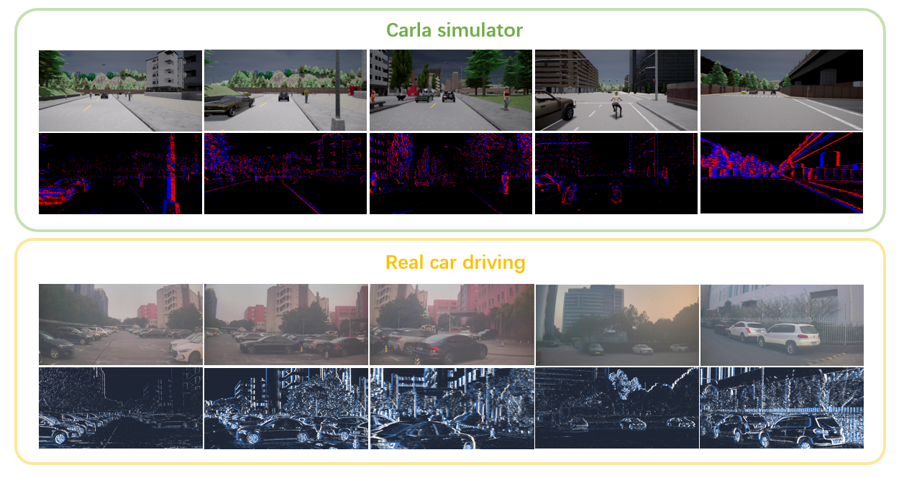

# LiS-Net

This is the code for the paper **LiS-Net A Brain Inspired Framework for Event Based End-to-End Steering Prediction**

## EventScape Dataset

This work uses the EventScape dataset which can be downloaded here:

* [Training Set (71 Gb)](http://rpg.ifi.uzh.ch/data/RAM_Net/dataset/Town01-03_train.zip)
* [Validation Set (12 Gb)](http://rpg.ifi.uzh.ch/data/RAM_Net/dataset/Town05_val.zip)
* [Test Set (14 Gb)](http://rpg.ifi.uzh.ch/data/RAM_Net/dataset/Town05_test.zip)

    

## Our-collected Dataset
* [h5 data for E2E validation (3.2 Gb)](https://drive.google.com/drive/folders/1P3GckCajeyxhczSDOWTOwnyCqb9MURMA?usp=drive_link)

* [original data (6.6 Gb)](https://drive.google.com/drive/folders/1vWsLN6WxOup-huPDRvMFoNlq52HmUHRA?usp=drive_link)
